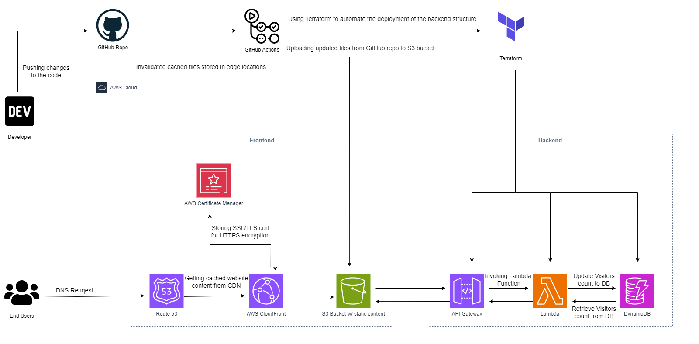

# Dhruv Shah - Cloud Resume
 A Cloud Resume Challenge AWS Edition by Forrest Brazeal

 ### Project Overview
 This project demonstrates the deployment of a cloud-based resume website using various AWS services and automation tools. The architecture ensures scalability, security, and reliability while automating infrastructure deployment using Terraform.

 ### DEMO
 Visit the below link to view my resume website hosted on S3.
 
[www.dhruvmshah.site](www.dhruvmshah.site)

### Architecture

### Architecture Description
The project architecture is divided into two main components: *Frontend* and *Backend*.
1. **Frontend**:
    - Developer Workflow:
        - The developer pushes code changes to a GitHub repository.
        - GitHub Actions automate the process of uploading the updated static files to an S3 bucket.
    - AWS Services Involved:
        - **Route 53**: DNS requests and directs them to the appropriate resources.
        - **AWS Certificate Manager**: Stores SSL/TLS certificates to enable HTTPS encryption for secure connections.
        - **AWS Cloudfront**: Distributes cached website content from a Content Delivery Network (CDN) to enhance the website's performance and availability.
        - **S3 Bucket**: Hosts static content, such as HTML, CSS, and JavaScript files, which are served to users through CloudFront.
2. **Backend**:
    - AWS Services Involved:
        - **API Gateway**: Acts as an entry point for API requests.
        - **Lambda**: Executes backend logic for managing and processing visitor data.
        - **DynamoDB**: Stores and retrieves visitor counts in a highly scalable and low-latency NoSQL database.
    - Automation:
        - Terraform is used to automate the deployment and management of backend infrastructure.

### Pre-requisites
To deploy this project, you will need:
- An AWS account with appropriate permissions.
- A GitHub account for version control and CI/CD with GitHub Actions.
- Basic knowledge of AWS services, Terraform, and GitHub Actions.

### Conclusion
This project showcases a complete end-to-end cloud-based resume website deployed using AWS services and automated with Terraform. It emphasizes best practices in cloud architecture, such as using a CDN for content delivery, securing traffic with HTTPS, and leveraging serverless compute with Lambda for backend operations.

